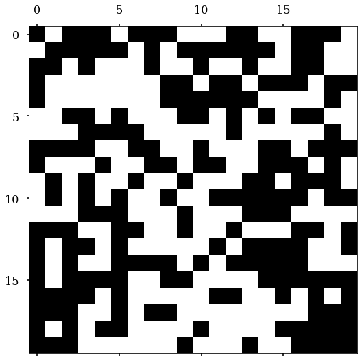
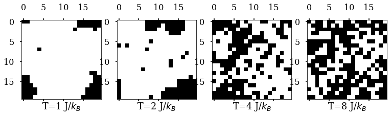
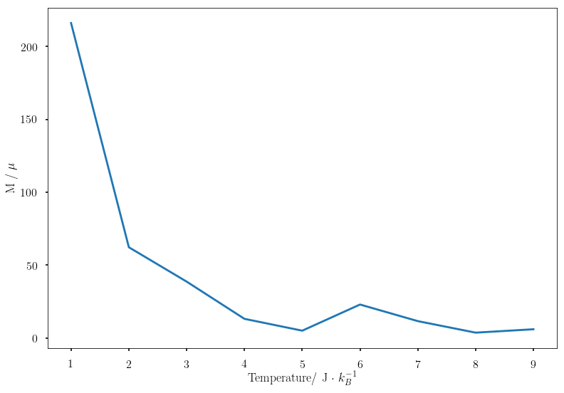

# Monte Carlo Simulation of Ising model

​									A randomly generate initial state, the black is **spin up**, white one is **spin down**

A rough overview (using only 1 trajectory) of the temperature influence on the equilibrium state, **10000 moves**

Shown above is the temperature dependence of the **net spin** (100 trajectories $\times$ 10000 steps)

**TO DO NEXT**: Sample more trajectory in a **parallel** way, more temperature point, more iteration steps

